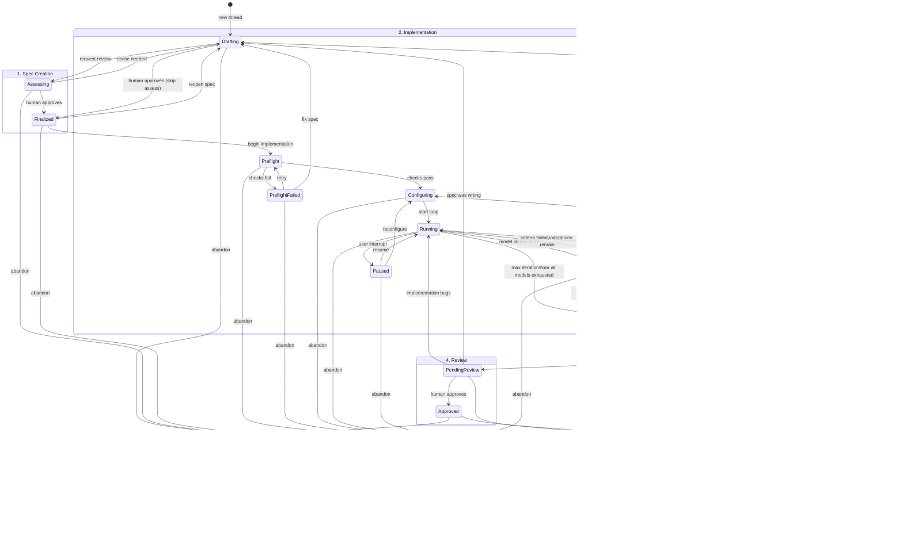

# ralf Thread State Machine

A thread in ralf represents a single feature, fix, or work item. Each thread progresses through phases with well-defined states and transitions.

## State Diagram



## States Reference

### Phase 1: Spec Creation

| State | Description | Human Action Required |
|-------|-------------|----------------------|
| **Drafting** | Interactive dialog with AI to create/refine the spec | No (but human drives conversation) |
| **Assessing** | AI reviews spec for clarity, testability, completeness | No (advisory feedback) |
| **Finalized** | Spec is locked and ready for implementation | **Yes** - human must approve |

### Phase 2: Implementation

| State | Description | Human Action Required |
|-------|-------------|----------------------|
| **Preflight** | Checking prerequisites (clean git, tools, parseable spec) | No |
| **PreflightFailed** | Prerequisites not met | **Yes** - human must fix |
| **Configuring** | Set up models, iterations, verifiers | Optional (can use defaults) |
| **Running** | Autonomous loop executing | No |
| **Paused** | User interrupted the loop | **Yes** - human decides next step |
| **Verifying** | Checking completion criteria | No |
| **Stuck** | Loop couldn't complete the task | **Yes** - human must decide next step |
| **Implemented** | All criteria verified as passing | No |

### Phase 3: Polish (Optional)

| State | Description | Human Action Required |
|-------|-------------|----------------------|
| **Polishing** | Adding docs, tests, cleanup | Optional |

> **Note**: Polish happens *before* review, not after. Any code changes require re-review.

### Phase 4: Review

| State | Description | Human Action Required |
|-------|-------------|----------------------|
| **PendingReview** | Changes ready for human inspection | **Yes** - human must review |
| **Approved** | Human confirmed changes are correct | **Yes** - human approved |

### Phase 5: Complete

| State | Description | Human Action Required |
|-------|-------------|----------------------|
| **ReadyToCommit** | Ready to commit/merge | **Yes** - human must commit |
| **Done** | Committed and complete | No |

### Terminal States

| State | Description |
|-------|-------------|
| **Done** | Successfully completed and merged |
| **Abandoned** | Thread was abandoned (can happen from any state) |

## Transitions Reference

### Forward Transitions

| From | To | Trigger |
|------|-----|---------|
| (new) | Drafting | Create new thread |
| Drafting | Assessing | User requests AI review |
| Drafting | Finalized | User approves spec (skipping assessment) |
| Assessing | Finalized | User approves after reviewing feedback |
| Finalized | Preflight | User starts implementation |
| Preflight | Configuring | All preflight checks pass |
| Configuring | Running | User starts the loop |
| Running | Verifying | Model outputs promise tag |
| Verifying | Implemented | All criteria pass verification |
| Implemented | Polishing | User wants to add docs/tests |
| Implemented | PendingReview | User skips polish, ready for review |
| Polishing | Implemented | Polish complete (goes back to allow more polish or proceed) |
| PendingReview | Approved | User approves changes |
| Approved | ReadyToCommit | Prepare commit message |
| ReadyToCommit | Done | User commits |

### Backward Transitions

| From | To | Trigger | Workspace Action |
|------|-----|---------|------------------|
| Assessing | Drafting | AI found issues | None (spec only) |
| Finalized | Drafting | User reopens spec | None (spec only) |
| PreflightFailed | Drafting | Spec needs fixes | None |
| Verifying | Running | Criteria failed | None (continue loop) |
| Running | Stuck | Max iterations | None (preserve state) |
| Verifying | Stuck | Criteria failed, no iterations | None |
| Stuck | Drafting | Spec was wrong | **Reset to baseline** |
| Stuck | Configuring | Try different config | None |
| Stuck | Running | Manual assist | None (human edited files) |
| PendingReview | Running | Implementation bugs | None (continue fixing) |
| PendingReview | Drafting | Spec was wrong | **Reset to baseline** |

### User Control Transitions

| From | To | Trigger |
|------|-----|---------|
| Running | Paused | User interrupt (Ctrl+C) |
| Paused | Running | User resumes |
| Paused | Configuring | User wants to reconfigure |
| Any | Abandoned | User abandons thread |

### Terminal Transitions

| From | To | Trigger |
|------|-----|---------|
| Done | (end) | Thread complete |
| Abandoned | (end) | Thread abandoned |

## Preflight Checks

Before entering `Running`, the Preflight state verifies:

1. **Git state**: Working tree is clean (or on a managed branch)
2. **Baseline captured**: Can restore to pre-implementation state
3. **Spec valid**: Promise tag present, criteria parseable
4. **Tools available**: Required models/verifiers accessible
5. **No conflicts**: No other thread is Running

If any check fails → `PreflightFailed` with clear error message.

## The "Stuck" State

When implementation can't complete, the user has options:

```
┌─────────────────────────────────────────────────────┐
│  STUCK: What would you like to do?                  │
├─────────────────────────────────────────────────────┤
│  [R] Revise spec     → Resets workspace, Drafting   │
│  [C] Reconfigure     → Configuring (keep changes)   │
│  [M] Manual assist   → Running (after human edits)  │
│  [A] Abandon         → Abandoned                    │
│  [D] Diagnose        → (view details, stay Stuck)   │
└─────────────────────────────────────────────────────┘
```

The stuck state preserves:
- Which spec version was attempted
- How many iterations were run
- Which criteria passed/failed
- The closest-to-success output
- Git diff from baseline

## The "Paused" State

User can interrupt a running loop (Ctrl+C) without losing progress:

```
┌─────────────────────────────────────────────────────┐
│  PAUSED: Loop interrupted                           │
├─────────────────────────────────────────────────────┤
│  Iteration: 3/10                                    │
│  Current model: claude                              │
│  Criteria: 2/4 passing                              │
│                                                     │
│  [R] Resume          → Continue from here           │
│  [C] Reconfigure     → Change models/iterations     │
│  [A] Abandon         → Abandon thread               │
└─────────────────────────────────────────────────────┘
```

## Git Safety Model

### Baseline Capture

When transitioning `Finalized → Preflight`:
1. Record current branch name
2. Record current HEAD commit SHA
3. Create `ralf/<thread-id>` branch (or verify clean state)

### Workspace Reset

When transitioning backward (Stuck → Drafting, PendingReview → Drafting):
1. Prompt user: "This will reset changes. Continue?"
2. `git checkout <baseline-branch>`
3. `git reset --hard <baseline-sha>` (or `git stash`)
4. Delete `ralf/<thread-id>` branch if created

### Normal Completion

When reaching `Done`:
1. Changes are on `ralf/<thread-id>` branch
2. User commits with generated message
3. User merges to target branch (outside ralf)

## Quick Mode vs Methodical Mode

> **Important**: Quick mode uses the *same states* with fewer required stops. It does NOT bypass human checkpoints—it auto-advances to them.

```
┌─────────────────────────────────────────────────────┐
│              METHODICAL MODE                        │
│                                                     │
│  Drafting ──▶ Assessing ──▶ Finalized              │
│                   │                                 │
│        (AI review, may loop back)                   │
│                                                     │
│  Preflight ──▶ Configuring ──▶ Running ──▶ ...     │
│                    │                                │
│         (manual model selection)                    │
│                                                     │
│  Implemented ──▶ Polishing ──▶ PendingReview       │
│                      │                              │
│           (add docs/tests)                          │
└─────────────────────────────────────────────────────┘

┌─────────────────────────────────────────────────────┐
│                QUICK MODE                           │
│                                                     │
│  Drafting ──────────────────▶ Finalized            │
│                                                     │
│        (skip assessment, trust the spec)            │
│                                                     │
│  Preflight ──▶ Configuring ──▶ Running ──▶ ...     │
│                    │                                │
│          (use default config)                       │
│                                                     │
│  Implemented ─────────────────▶ PendingReview      │
│                                                     │
│          (skip polish, go straight to review)       │
│                                                     │
│  If all tests pass: Show "Recommend Approve" badge  │
│  Human STILL must approve (no auto-approve)         │
└─────────────────────────────────────────────────────┘
```

### Quick Mode Behavior

| Phase | Methodical | Quick |
|-------|------------|-------|
| Assessment | Required review | Skipped |
| Configuration | Manual selection | Use defaults |
| Polish | Prompted | Skipped |
| Review | Human approves | Human approves (with recommendation if tests pass) |
| Commit | Human commits | Human commits |

**Key invariant**: Human checkpoints (Finalize, Approve, Commit) are NEVER skipped.

## Human Checkpoints

Four gates **always** require human approval:

1. **Finalize Spec** (Drafting → Finalized)
   - Commits you to a direction
   - Implementation will try to build exactly this

2. **Handle Stuck** (when in Stuck state)
   - Decides whether to revise, reconfigure, assist, or abandon
   - Critical decision point

3. **Approve Review** (PendingReview → Approved)
   - Confirms the implementation is correct
   - This is what will be committed

4. **Commit** (ReadyToCommit → Done)
   - Affects shared codebase
   - No undo after this point

## State Persistence

Thread state must survive crashes and restarts.

### Atomic Writes

All state changes use atomic write pattern:
1. Write to unique temp file: `thread.json.<random>.tmp`
2. `fsync()` the file
3. Rename to `thread.json`
4. Clean up temp file on error

### Schema Versioning

```json
{
  "schema_version": 1,
  "id": "abc123",
  "title": "Add feature X",
  "phase": {"type": "Running", "data": {"iteration": 3}},
  "current_run_id": "run-001",
  "baseline": {"branch": "main", "commit_sha": "abc...", "captured_at": "..."},
  ...
}
```

Note: Phase uses tagged enum serialization (`#[serde(tag = "type", content = "data")]`):
- Unit variants: `{"type": "Drafting"}`
- Data variants: `{"type": "Running", "data": {"iteration": 3}}`

Migration logic handles older versions on load.

### What's Stored Where

All paths relative to `.ralf/` directory.

| Data | Location | Why |
|------|----------|-----|
| Thread state (phase, pointers, baseline) | `threads/<id>/thread.json` | Small, frequently updated |
| Spec revisions | `threads/<id>/spec/v1.md` | Immutable after creation |
| Active thread (UI selection) | `active_thread` | Plain text file with thread ID |
| Run records | `runs/<run-id>/run.json` | Append-only |
| Run outputs | `runs/<run-id>/output.log` | Large, append-only |
| Spec conversation | `spec/threads/<id>.jsonl` | Append-only, line-delimited |
